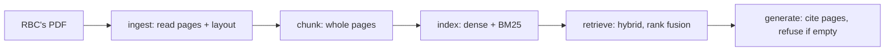

# Bank Filings Analyst: question answering over RBC's annual report

Ask a question about RBC's 2024 Annual Report and get an answer back with the page
it came from.

## In plain words

I built the first version of this in a weekend. It answered questions and named a
page for each one, and it looked like it worked. Then I realized I had no way to know
how often it named the right page. So measuring that became the project. I wrote an
[answer key](docs/glossary.md#answer-key) by hand, tried several ways of splitting and
searching the report, and wrote down every question the best setup still gets wrong,
and why.

One thing up front: the search runs on my own machine, but writing the final answer
calls Google's Gemini API, so the pages it finds leave the machine at that point.
More on this in [How it works](#how-it-works).

## Try it

```bash
git clone https://github.com/Iliya-Valizadeh/bank-filings-rag.git
cd bank-filings-rag
make setup
make demo
```

`make demo` needs no download and no API key. It runs the real search code on a
short, made-up PDF (not RBC's report) and prints which made-up page it found for a
few made-up questions. It shows that the code runs. It is not a result: see
[What's weak](#whats-weak).

To run the real evaluation, you also need RBC's report (see
[data/README.md](data/README.md)) and, for an answer written by a model rather than
just the retrieved pages, a Gemini API key in `.env`:

```bash
make eval   # regenerates every number in this README
```

## Result

On the 12 questions I checked myself by reading the report, splitting the report into
whole pages and searching with [hybrid search](docs/glossary.md#hybrid-search) puts
the right page in the top 5 results ([hit@5](docs/glossary.md#hit5)) for 0.58 of them,
against a 95% [confidence interval](docs/glossary.md#confidence-interval) of 0.33 to
0.83. The first version of this project, fixed 180-word
[chunks](docs/glossary.md#chunk) with [dense search](docs/glossary.md#dense-search)
alone, is the [baseline](docs/glossary.md#baseline): it scores 0.25 (0.00 to 0.50).

| Split the report into | Search | hit@5 | 95% interval |
|---|---|---|---|
| Fixed 180-word chunks (baseline) | dense | 0.25 | 0.00 to 0.50 |
| Whole pages | dense | 0.50 | 0.25 to 0.75 |
| Whole pages | hybrid | 0.58 | 0.33 to 0.83 |

With only 12 questions, one more right or wrong answer moves hit@5 by about one in
twelve <!-- not-a-claim -->, and every interval above overlaps the others. I can't
claim any one setup beats another on these 12 alone.


The chart shows hit@5 for every combination of chunking and search on all 30
questions (12 hand-checked, 18 checked by a script only). Whole pages with hybrid
search comes out on top in every case, but its interval overlaps with plain dense
search over whole pages.

## How I worked

I wrote the [evaluation plan](docs/eval_plan.md) after the results existed, not
before. That page says so in its own title, and it is honest about what that costs:
git shows that the scoring rule and the first results appeared in the same commit,
`5ec3c84`, so nothing here proves the rule was fixed before I saw a number. What the
history does show is that the strict score (a hit only on a page the answer key
lists) was the only score when the first results came out, and it gives the lower,
more careful number of the two scores this project reports. That is why it stays the
headline: not because it came first, but because a later, friendlier score never
replaced it.

The decisions behind the main choices are in [docs/decisions/](docs/decisions/):
local [embeddings](docs/glossary.md#embedding) ([ADR 0002](docs/decisions/0002-local-embeddings.md)),
whole pages as the unit ([ADR 0003](docs/decisions/0003-whole-pages-as-the-unit.md)),
the strict and lenient scores ([ADR 0004](docs/decisions/0004-two-ways-of-scoring-a-hit.md)),
hybrid search ([ADR 0005](docs/decisions/0005-hybrid-search-with-rank-fusion.md)), and
the 12-question headline ([ADR 0006](docs/decisions/0006-headline-on-hand-checked-questions.md)).
Every miss of the best setup is explained by hand in
[reports/error_analysis.md](reports/error_analysis.md).

### Two ways of scoring a hit

The strict score, above, counts a hit only when a retrieved page is one the answer
key lists. But a figure in a financial report often sits on more than one page, so I
also report a [lenient hit](docs/glossary.md#lenient-hit): a hit is any retrieved
[chunk](docs/glossary.md#chunk) that contains the answer's text. For the best setup, lenient hit@5 is 0.83
against a strict 0.58 on the 12 hand-checked questions. The gap shows how much the
strict score understates retrieval, but the lenient score is never the headline,
because it can also count a page that answers a different question by coincidence.

### The answer key

[eval/gold_qa.jsonl](eval/gold_qa.jsonl) has 30 questions. I wrote and read the first
10 myself. I drafted 20 more to cover exact terms (PCL, NIM, LCR, NSFR, RWA), segment
tables, plain facts, and questions whose answer spans two pages. Of those 20, I have
since read Q28 and Q29 myself, for 12 hand-checked questions in total.

[eval/check_gold.py](eval/check_gold.py) runs two script checks on the other 18
proposed pages. The first looks for the answer text anywhere on the page. 28 of the
30 questions pass this check; Q8 and Q10 have no short answer string to search for,
so the script cannot check them at all. The second check is stricter: for questions
11 to 30, it looks for the label and the figure (say "Net interest margin" and
"1.54%") close together, in the same passage of the PDF. 18 of those 20 pass. Q28 and Q29 did not, so
I read both by hand: the pages were right, and I fixed Q29's answer text to match the
page. Full results are in [eval/gold_check.md](eval/gold_check.md). A script can catch
a wrong page number, but not a badly worded question, so the other 18 questions stay
"checked by script only" until I read them myself.

## How it works



`ingest.py` reads the text of every page and the layout blocks PyMuPDF finds on it,
and keeps the page number attached to both. `chunking.py` turns pages into whole-page
chunks (or, for comparison, fixed windows or paragraphs).
`embed_index.py` turns each chunk into a local [embedding](docs/glossary.md#embedding)
and builds a FAISS index; no text leaves the machine at this step. `retrieve.py` runs
dense search, [BM25](docs/glossary.md#bm25) keyword search, or both merged by
[reciprocal rank fusion](docs/glossary.md#reciprocal-rank-fusion): each chunk scores
1 / (60 + rank) for every list it appears in, so the two very different score scales
never need to be matched up. `generate.py` hands the top 5 pages to Gemini, told to
cite pages and never guess; if nothing was retrieved, it refuses without calling the
model.

### Where the local part stops

Turning the report into vectors and searching it both run on my own machine, not a
hosted API. RBC's report is public, so nothing here needed protecting, but I built it
this way because a bank running the same pipeline over its own confidential filings
could not send them to an outside service, and I wanted the search half to already
work under that rule. Writing the final answer calls Gemini, so the five retrieved
pages are sent to a third party on every question that uses it. Closing that gap
means swapping the generator for a self-hosted or bank-approved model, which changes
one file (`src/bank_filings_rag/generate.py`) and none of the search code.

### Example

```
$ python -m bank_filings_rag.ask --pdf data/raw/rbc_2024.pdf "What was RBC's net income in fiscal 2024?"
...
Cited pages: [7, 9, 12, 49, 55] | LLM used: False
```

This is a run with no Gemini key, so it prints the retrieved pages only. Page 7 does
have the answer ("record earnings of $16.2 billion"), but page 23, which has the
summary table the answer key names, is not in the top 5. That is the same kind of
miss as Q1 in [reports/error_analysis.md](reports/error_analysis.md).

## What's weak

The biggest limit is size: only 12 questions are checked by hand, and the 30-question
table includes 18 that are checked by script only. One question moves hit@5 by about
one in twelve, and the top setups' intervals overlap, so a few more questions could
change which setup looks best.

The next biggest is the [embedding](docs/glossary.md#embedding) model itself:
`all-MiniLM-L6-v2` reads at most 256
[word pieces](docs/glossary.md#word-piece) and ignores the rest of a page. A page here
has a median of 981 word pieces, and 96% of pages are longer than 256. Five of the
nine questions the best setup misses have their answer past that point, which is the
largest single cause of the misses I found in
[reports/error_analysis.md](reports/error_analysis.md).

The full, ranked list, with what I have and have not done about each one, is in
[docs/whats_weak.md](docs/whats_weak.md). It also covers: no held-out questions, the
strict score's undercount, the unpinned model revision, un-tuned fusion settings, lost
table headers, and a test coverage floor of 47% on the code that turns search results
into these numbers (see [docs/ml_test_score.md](docs/ml_test_score.md) for the full
self-assessment).

## Docs

- Tutorial: [docs/tutorial.md](docs/tutorial.md)
- How-to guides: [docs/how-to/](docs/how-to/)
- Reference: [docs/reference.md](docs/reference.md)
- Explanation: [docs/explanation.md](docs/explanation.md)

## Repo map

<!-- repo-map:start -->
| Path | What it holds |
|---|---|
| `.github/` | CI workflows and GitHub settings |
| `CLAIMS.md` | Every number in the docs, with its source file and command |
| `data/` | Small data files, or scripts that download the data |
| `docs/` | Evaluation plan, decisions, glossary and the four kinds of docs |
| `eval/` | The answer key, the scripts that score it, and the scoring code |
| `Makefile` | One command for each step: setup, lint, test, eval, demo |
| `notebooks/` | Exploration notebooks (not used to make the reported numbers) |
| `reports/` | Generated results, including `metrics.json` and the error analysis |
| `scripts/` | One-off scripts, such as building the demo PDF |
| `src/` | The package code |
| `tests/` | Unit and data tests |
| `tools/` | Checks for claims, readability, AI-writing signs and links |
<!-- repo-map:end -->

## Author

Iliya Valizadeh, BSc Data Science, York University.
GitHub: [Iliya-Valizadeh](https://github.com/Iliya-Valizadeh)
