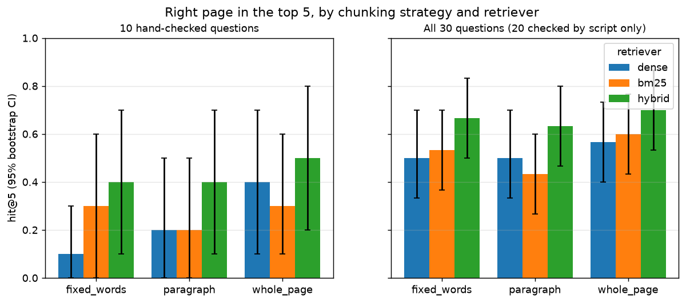

# Bank Filings Analyst: question answering over RBC's annual report

Ask a question about RBC's 2024 Annual Report (250 pages) and get an answer back with the
page it came from.

I built the first version in a weekend. It answered questions and cited pages, and it
looked like it worked. Then I realised I had no way to know how often it pulled the
right page. So the measurement became the project. I wrote an answer key, compared
several ways of splitting and searching the report, and wrote down every question it
still gets wrong and why.

One caveat up front: the embedding and search steps run locally, but the answer-writing
step calls Google's Gemini API, so the retrieved pages leave the machine at that point.
More on this below.

## Results

### The 10 questions I checked by hand

"hit@5" is the share of questions where the right page is in the top 5 results.

| Split the report into | Search | hit@5 | 95% interval |
|---|---|---|---|
| Fixed 180-word chunks | meaning only (dense) | 0.10 | 0.00 to 0.30 |
| Whole pages | meaning only (dense) | 0.40 | 0.10 to 0.70 |
| Whole pages | hybrid (dense + keyword) | 0.50 | 0.20 to 0.80 |

With 10 questions, one question moves hit@5 by 0.10, and every interval above overlaps
with the others. On these 10 alone I can't claim any configuration beats another.

### All 30 questions

This includes 20 questions whose pages a script has checked but I haven't yet read
(see "The answer key" below).

| Split the report into | Dense | Keyword (BM25) | Hybrid |
|---|---|---|---|
| Fixed 180-word chunks (1,355 pieces) | 0.50 | 0.53 | 0.67 |
| Paragraphs (1,146 pieces) | 0.50 | 0.43 | 0.63 |
| Whole pages (250 pieces) | 0.57 | 0.60 | 0.70 (0.53 to 0.87) |

Hybrid search came out on top for every way of splitting the report. Its intervals still
overlap with dense, so I checked question by question. Over whole pages, hybrid found 5
questions that dense missed, and dense found 1 that hybrid missed. The full tables, with
MRR and intervals for every row, are in
[reports/chunking_comparison.md](reports/chunking_comparison.md).



### Two ways of scoring a hit

The strict score counts a hit only when a retrieved page is
one I wrote down in the answer key. But the same figure often appears on several pages:
net income of 16,240 is on 13 of them. So I also report a lenient score, where a hit is
any retrieved chunk that contains the answer text. For the best configuration it's 0.83
against a strict 0.70. The strict score is the headline because I defined it before I
saw any results. The lenient one shows how much the strict score understates retrieval.

## What I found out along the way

### The paragraph splitter never split anything

The first version split text on blank
lines. pypdf, the PDF reader, puts no blank lines in this report (0 of 250 pages). So the
"paragraph" strategy returned one piece per page, 249 pieces for 250 pages, and my
original results table compared whole pages with themselves. It now splits on the layout
blocks PyMuPDF detects, which gives 1,146 pieces. Real paragraphs score lower than the
fake ones did (0.20 vs 0.40 on the 10 hand-checked questions, dense search), which fits
the next finding.

### The embedding model reads only the top of a page

all-MiniLM-L6-v2 reads at most 256
word pieces and ignores the rest. A median page here is 981 word pieces, and 96% of pages
are longer than 256. So a whole-page vector mostly describes the page's first quarter.
Five of the nine questions the best configuration misses have their answer past that
point. Keyword search reads the whole page, which is a large part of why hybrid helps.
The numbers are in [notebooks/01_explore.ipynb](notebooks/01_explore.ipynb).

### Why whole pages still win

A number in a financial report only means something next
to its label. Fixed 180-word windows often separate a figure from the row or heading that
names it. A page keeps them together, and the page is also the unit being cited.

## The errors

Every question the best configuration gets wrong is in
[reports/error_analysis.md](reports/error_analysis.md), with the pages it retrieved and a
one-line cause. In short:

- 5 of 9: the answer is past the 256-word-piece window on its page
- 4 of 9: a retrieved page does contain the answer, just not the page in the key
- 2 of 9: it retrieved the page next to the right one, in the same section
- 2 of 9: a word in the question means something else elsewhere ("NIM" appears in every
  segment table, and "Insurance" in the insurance accounting notes)
- 1 of 9: the answer key is too narrow. It retrieved two pages that do list the business
  segments, but the key names only a third.

(A question can have more than one cause.)

## The answer key

[eval/gold_qa.jsonl](eval/gold_qa.jsonl) has 30 questions. The first 10 I wrote and
checked by reading the report. They are marked `"verified": true`. I drafted the other
20 to cover exact terms (PCL, NIM, LCR, NSFR, RWA), segment tables, plain facts, and three
questions whose answer spans two pages. Each has a proposed page, marked
`"verified": false`.

[eval/check_gold.py](eval/check_gold.py) runs two checks on the proposed pages. The
first looks for the answer text on the page, and all 30 questions pass. The second is
stricter: for questions 11 to 30 it looks for the label and the figure (say "Total PCL"
and "3,232") in the same passage of the PDF, no more than 200 characters apart. 18 of 20
pass. For Q28 (a list of nine banks) and Q29 (one long sentence) the label and figure are
in the same passage but further apart than that, so those two need a read. Results are
in [eval/gold_check.md](eval/gold_check.md). A script can catch a wrong page number, but
it can't tell whether a question is well posed, so all 20 stay unverified until I read
them.

## How it works

```
RBC 2024 Annual Report (PDF)
  ingest.py        page text (pypdf) and layout blocks (PyMuPDF), page number kept
  chunking.py      fixed windows, paragraphs from layout blocks, or whole pages
  embed_index.py   local sentence-transformers vectors in a FAISS index
  retrieve.py      dense, BM25 keyword, or hybrid (reciprocal rank fusion)
  generate.py      hand the top 5 to Gemini, told to cite pages and not guess
  eval/            answer key, page check, scoring, bootstrap intervals
```

Hybrid search runs both searches and merges the two ranked lists with reciprocal rank
fusion: each chunk scores 1/(60 + rank) for every list it appears in. It uses only the
ranks, so the two very different score scales never need to be matched up.

Every answer cites pages because the page number is attached to the text when the PDF is
read and carried through every step. If nothing is retrieved, the system refuses without
calling the model at all.

## Why the embeddings run locally, and where that stops

The text is turned into vectors on my own machine instead of being sent to a hosted API.
RBC's report is public, so nothing here needed protecting. I built it this way because a
bank running the same thing over internal documents couldn't send them to an outside
service, and I wanted the search half to already work under that rule.

Generation calls Gemini, so the five retrieved pages are sent to a third party on every
question. The privacy property covers indexing and search, not the whole pipeline.
Closing the gap means swapping the generator for a self-hosted or bank-approved model,
which changes one file (`src/generate.py`) and none of the search code.

## Example

```
$ python -m src.ask --pdf data/raw/rbc_2024.pdf "What was RBC's net income in fiscal 2024?"
...
Cited pages: [7, 9, 12, 49, 55] | LLM used: False
```

This is the run without an API key, which shows the retrieved pages only. p. 7 has the
answer ("record earnings of $16.2 billion"). p. 23, which has the summary table, isn't in
the top 5. That's the same kind of miss as Q1 in the error analysis.

## Reproduce

```bash
python -m venv .venv && source .venv/bin/activate   # Windows: .venv\Scripts\activate
pip install torch==2.14.0 --index-url https://download.pytorch.org/whl/cpu
pip install -r requirements.txt
# download the filing to data/raw/rbc_2024.pdf (see data/README.md)
make eval      # or: python -m eval.check_gold --pdf data/raw/rbc_2024.pdf
               #     python -m eval.evaluate  --pdf data/raw/rbc_2024.pdf
```

`make eval` regenerates every number in this README. Hit rates and MRR come out identical
on every run. Latency varies from run to run by a few milliseconds.

Tests (`pytest`) and linting (`ruff`) run in GitHub Actions on every push. They use a
fake encoder, so they need neither the PDF, the model download nor an API key. For an
answer written by the model, copy `.env.example` to `.env` and add a Gemini key.

## What I know is weak

- Only 10 questions are checked by hand. The 30-question numbers include 20 that a
  script checked but I haven't read yet. Until I do, treat that table as provisional.
- Even the best configuration misses 9 of 30. The largest single cause is the 256-word-piece
  window. Splitting long pages for the vectors while still citing whole pages is the
  first fix I'd try.
- Fusion can lose a correct keyword hit (Q10 in the error analysis). The fusion weights
  aren't tuned.
- The embedding model is a small one. A larger one with a longer window would likely
  change the numbers.
- Tables lose their column headers when the text is extracted, which hurts on a filing.
- The answer quality from Gemini isn't scored. I only measure whether the right page is
  retrieved.
- It's one document. Nothing here shows how it would do on another bank's report.
- The search index compares against every vector. That's exact and fine at 1,355 pieces,
  but it would need replacing on a large document set.

## Author

Iliya Valizadeh, BSc Data Science, York University.
GitHub: [Iliya-Valizadeh](https://github.com/Iliya-Valizadeh)
